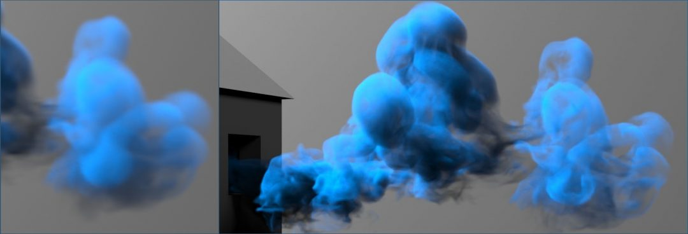
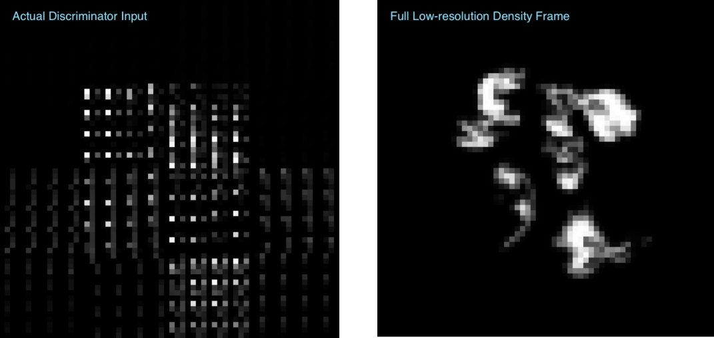

# tempoGAN
Here you can find the source code for the SIGGRAPH paper "tempoGAN: A Temporally Coherent, Volumetric GAN for Super-resolution Fluid Flow".
Authors: You Xie, Erik Franz, MengYu Chu, Nils Thuerey. Technical University of Munich.

Below you can find a quick intro how to get started with the source code,
in addition to clarifications regarding the main paper.

Paper: <https://arxiv.org/pdf/1801.09710.pdf>
Main accompanying video: <https://youtu.be/i6JwXYypZ3Y>
Supplemental video: <https://youtu.be/1KZieEcADKg>
You can also check out further details our TUM lab homepage: <https://ge.in.tum.de/publications/tempoGAN/> , or
download pre-trained models below.



# Getting started
This is a brief overview and getting-started guide for the source code of 
the tempoGAN project. It can also be found under tempoGAN/tensorflow/tempoGAN/README.txt.

## Software and Installation

Note: tensorflow (we recommend using tensorflow 1.12 to 1.14) is required to run.

For GPU training use the following packages:
 - *CUDA 10.0*
 
 	Visit Nvidia website > cuda downlaods [here](https://developer.nvidia.com/cuda-10.0-download-archive). Download and install it.
 - *cudnn 7.6*
 
 	Visit [cuda]() website, download and install it.
	
	Visit Nvidia website > cudnn downlaods [here](https://developer.nvidia.com/rdp/cudnn-download). Take the survey, download and install it.
 - *tensorflow-gpu 1.13*
 
 	Just install with a package manager:
	
	`pip3 install tensorflow-GPU==1.13` 
 - *imageio*,*keras*,*scipy*,*python-numpy*
 
 	Just install with a package manager. Python-numpy package is required because sometimes cmake do not find numpy include directory:
	
	`pip3 install imageio keras scipy python-numpy` 


## Directories
Main source code directories:

`.../tensorflow/datagen:` scene files for generating 2D/3D training data

`.../tensorflow/tools:`   contains necessary tools for inputs, outputs, 
					    neural networks operation, and etc.

`.../tensorflow/GAN:`     contains the tempoGAN model.

And two data directories were outputs will be written:

`.../tensorflow/2ddata_sim:` contains the training, validation and test data

`.../tensorflow/2ddata_gan:` outputs will be written here

## Compilation
First, compile mantaflow with numpy support (as usual), follow 
http://mantaflow.com/install.html.
One difference is, in the CMake settings, numpy shoule be enabled: 
"cmake .. -DGUI=ON -DOPENMP=ON -DNUMPY=ON".
Note that if mantaflow is installed on a remote server, GUI is not supported, i.e.:
"cmake .. -DGUI=OFF -DOPENMP=ON -DNUMPY=ON".

All of the following scripts assume that you execute them 
from the mantaflow/tensorflow/tempoGAN/ directory (they often
use relative paths).

## Data Generation
Then generate simulation data with the following command, e.g.:

`../../build/manta ../datagen/gen_sim_data.py basePath ../2ddata_sim/ reset 1 saveuni 1`

You can add "gui 0" on the command line to hide the UI and speed up the data
generation runs. Make sure to use *saveuni* parameter, otherwise tempoGAN will throw some errors not finding *.uni files. Also generate the sample plume data (gen_sim_2006.py for 2D,
gen_sim_3006.py for 3D) into the 2ddata_sim directory.

## Training
Then you can start to train a GAN using:

`python example_run_training.py`

This trains four models, for a quick test disable the later three. These
example only use 2 simulations as training data. To train proper models, we
recommend ca. 200 frames of input from at least 10 sims.

Instead of training your own model (which can take a while, especially in 3D),
you can also download on of our pre-trained models. A 2D model is available here: 
<https://ge.in.tum.de/download/data/tempoGAN_model2d.zip>
and this is the 3D version: 
<https://ge.in.tum.de/download/data/tempoGAN_model3d.tar.gz>.


## Applying the Model
After you trained a GAN model, you can use the model to generate new outputs:

`python example_run_output.py`

By default, these examples run on simulation "2006" and "3006" for 3D.

Note: all the commands above are just examples, please check parameters when
running them (esp. paths, simulation ID ranges etc.). The code currently uses
.uni files for reading and writing grids. This is the default file format of
mantaflow, so you can check out the sources at http://mantaflow.com/ 
for details on how to read and write these files.

# Addendum / Corrections

## Spatial Discriminator Input

One aspect of our network that we only realized recently was that the conditional, spatial discriminator only receives (and should receive) a tougher, jumbled-up low-res input to make its life harder. In our current implementation, it receives a quarter cut-out, combined with velocity information. This is illustrated in the image below: the left side shows the actual input the discriminator receives, while the right side shows the regular, full low-res frame.

We noticed that this is "not a bug, but a feature": when the discriminator receives the regular full-res frame, its job is too easy, and the GAN training quickly becomes unbalanced. We found it to be important to provide the discriminator with a challenging, yet useful input such that it's learning progress matches that of the generator network. Note that this is somewhat specific to our GAN training setup. It uses a “traditional” non-saturating loss formulation, as described by [Goodfellow et al. 2014]. For other similarity measures in GANs (such as Wasserstein distances) it will be preferable to provide the discriminator with a regular low-res frame due to the different balancing between the networks.



# BibTex citation

If you find this work useful, please consider citing the corresponding paper:

```
@article{xie2018tempoGAN,
    title={tempoGAN: A Temporally Coherent, Volumetric GAN for Super-resolution Fluid Flow},
    author={Xie, You and Franz, Erik and Chu, Mengyu and Thuerey, Nils},
    journal={ACM Transactions on Graphics (TOG)},
    volume={37},
    number={4},
    pages={95},
    year={2018},
    publisher={ACM}
}
```
